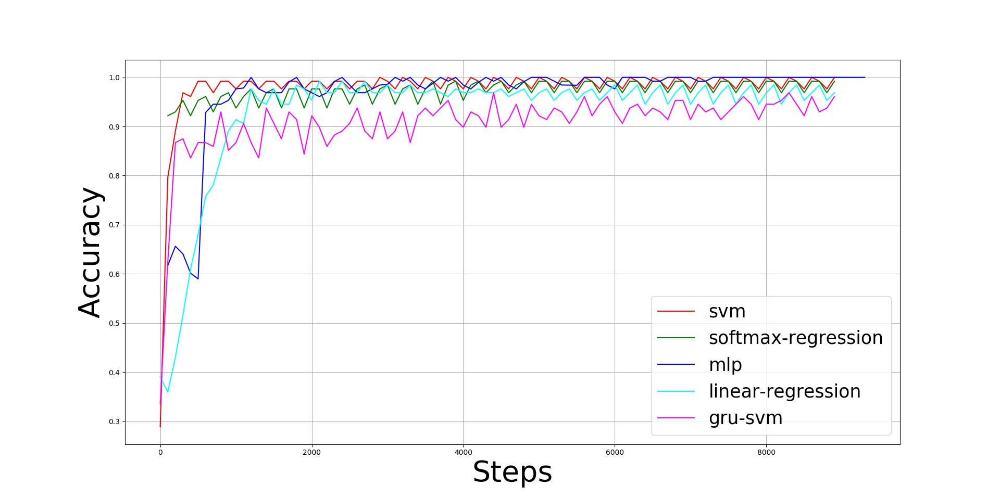

On Breast Cancer Detection: An Application of Machine Learning Algorithms on the Wisconsin Diagnostic Dataset
===

[]()
[]()

## Abstract
This paper presents a comparison of six machine learning (ML) algorithms: <a href="https://github.com/AFAgarap/gru-svm">
GRU-SVM</a><a href="http://arxiv.org/abs/1709.03082">[4]</a>, Linear Regression, Multilayer Perceptron (MLP),
Nearest Neighbor (NN) search, Softmax Regression, and Support Vector Machine (SVM) on the Wisconsin Diagnostic Breast
Cancer (WDBC) dataset <a href="https://archive.ics.uci.edu/ml/datasets/Breast+Cancer+Wisconsin+(Diagnostic)">[22]</a>
by measuring their classification test accuracy and their sensitivity and specificity values. The said dataset consists
of features which were computed from digitized images of FNA tests on a breast mass[22]. For the implementation of
the ML algorithms, the dataset was partitioned in the following fashion: 70% for training phase, and 30% for the
testing phase. The hyper-parameters used for all the classifiers were manually assigned. Results show that all the
presented ML algorithms performed well (all exceeded 90% test accuracy) on the classification task. The MLP algorithm
stands out among the implemented algorithms with a test accuracy of ~99.04% Lastly, the results are comparable
with the findings of the related studies[<a href="https://www.ijcit.com/archives/volume1/issue1/Paper010105.pdf">18</a>
, <a href="https://link.springer.com/chapter/10.1007%2F0-387-34224-9_58?LI=true">23</a>].

## Machine Learning (ML) Algorithms

* <a href="https://github.com/AFAgarap/wisconsin-breast-cancer/blob/master/main_gru_svm.py">GRU-SVM</a>
* <a href="https://github.com/AFAgarap/wisconsin-breast-cancer/blob/master/main_linear_regression.py">Linear Regression</a>
* <a href="https://github.com/AFAgarap/wisconsin-breast-cancer/blob/master/main_mlp.py">Multilayer Perceptron</a>
* <a href="https://github.com/AFAgarap/wisconsin-breast-cancer/blob/master/main_nearest_neighbor.py">Nearest Neighbor</a>
* <a href="https://github.com/AFAgarap/wisconsin-breast-cancer/blob/master/main_logistic_regression.py">Softmax Regression</a>
* <a href="https://github.com/AFAgarap/wisconsin-breast-cancer/blob/master/main_svm.py">L2-SVM</a> 

## Results
All experiments in this study were conducted on a laptop computer with Intel Core(TM) i5-6300HQ CPU @ 2.30GHz x 4,
16GB of DDR3 RAM, and NVIDIA GeForce GTX 960M 4GB DDR5 GPU.



**Figure 1. Training accuracy of the machine learning algorithms on breast cancer detection using WDBC.** 

Figure 1 shows the training accuracy of the ML algorithms: (1) GRU-SVM finished its training in 2 minutes and 54
seconds with an average training accuracy of 90.6857639%, (2) Linear Regression finished its training in 35 seconds
with an average training accuracy of 92.8906257%, (3) MLP finished its training in 28 seconds with an average training
accuracy of 96.9286785%, (4) Softmax Regression finished its training in 25 seconds with an average training accuracy
of 97.366573%, and (5) L2-SVM finished its training in 14 seconds with an average training accuracy of 97.734375%.
There was no recorded training accuracy for Nearest Neighbor search since it does not require any training, as the norm
equations (L1 and L2) are directly applied on the dataset to determine the “nearest neighbor” of a given data
point p_{i} ∈ p.

<br>

**Table 1. Summary of experiment results on the machine learning algorithms.**

|Parameter|GRU-SVM|Linear Regression|MLP|L1-NN|L2-NN|Softmax Regression|L2-SVM|
|---------|-------|-----------------|---|-----|-----|------------------|------|
|Accuracy|93.75%|96.09375%|99.038449585420729%|93.567252%|94.736844%|97.65625%|96.09375%|
|Data points|384000|384000|512896|171|171|384000|384000|
|Epochs|3000|3000|3000|1|1|3000|3000|
|FPR|16.666667%|10.204082%|1.267042%|6.25%|9.375%|5.769231%|6.382979%|
|FNR|0|0|0.786157%|6.542056%|2.803738%|0|2.469136%|
|TPR|100%|100%|99.213843%|93.457944%|97.196262%|100%|97.530864%|
|TNR|83.333333%|89.795918%|98.732958%|93.75%|90.625%|94.230769%|93.617021%|

Table 1 summarizes the results of the experiment on the ML algorithms. The parameters recorded were test accuracy,
number of data points (`epochs * dataset_size`), epochs, false positive rate (FPR), false negative rate (FNR), true
positive rate (FPR), and true negative rate (TNR). All code implementations of the algorithms were written using Python
with TensorFlow as the machine intelligence library.

## License
```buildoutcfg
Copyright 2017 Abien Fred Agarap

Licensed under the Apache License, Version 2.0 (the "License");
you may not use this file except in compliance with the License.
You may obtain a copy of the License at

http://www.apache.org/licenses/LICENSE-2.0

Unless required by applicable law or agreed to in writing, software
distributed under the License is distributed on an "AS IS" BASIS,
WITHOUT WARRANTIES OR CONDITIONS OF ANY KIND, either express or implied.
See the License for the specific language governing permissions and
limitations under the License.
```
