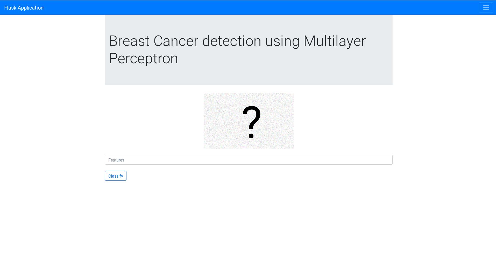

WDBC Classification using Feed-forward Neural Network
===

As we have decided on the notebook experiments, we implement a FFNN for Flask application.

## Usage

Install the pre-requisite libraries.

```
chmod +x setup.sh
./setup.sh
```

[Optional] Train the model.

```
python3 train.py --dataset breast-cancer-wisconsin.data
```

The training is optional at this point as we have a sample trained model in this package (`dnn.h5`).

Run the prototype Flask application.

```
python3 app.py
# go to localhost:5000/ in your browser
```


